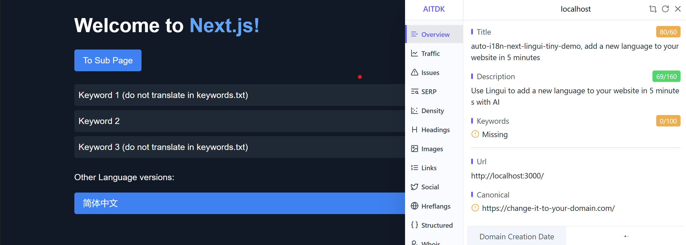
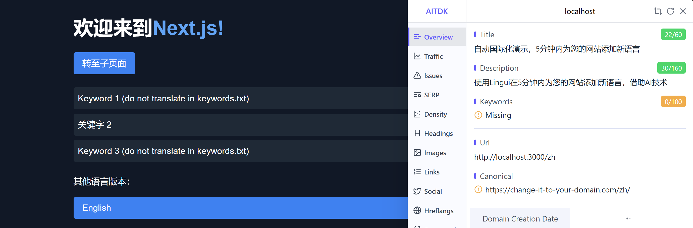
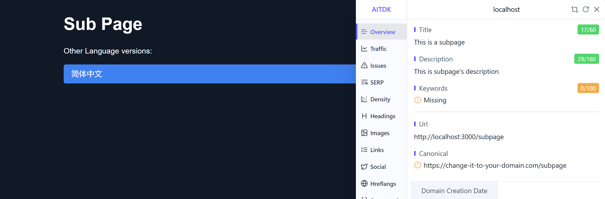
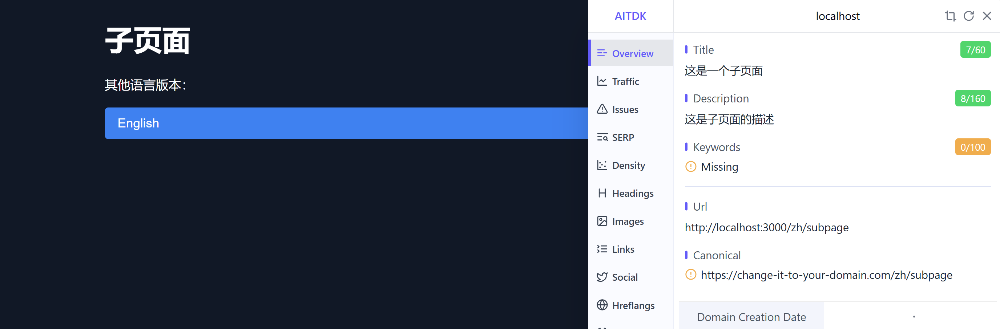

# auto-i18n-next-lingui-tiny-demo

直接看效果：https://auto-i18n-next-lingui-tiny-demo.vercel.app/

自动 i18n，5 分钟 + 0.1 美元 API 费用，就可以给全站增加一种新语言。

**tiny demo 是可运行，可复现，最简洁的技术验证。**

本仓库从 create-next-app 出发，创建一个最简洁但是功能完备的 demo。
要想知道增加了哪些文件，可以直接和 create-next-app 生成的代码对比。

技术选型和翻译脚本参考了 [yaakua/ai-outpainting-com](https://github.com/yaakua/ai-outpainting-com)，
非常感谢。因此我也把自己的更新分享出来。

## 技术选型

[lingui](https://lingui.dev/) 一个 AI 翻译友好的 i18n 库，配合脚本做自动翻译。
目前有小坑，需要和 Next.js 的版本完全匹配，要比较专业的前端知识才能排错。

所以我创建了这个 demo，这样后来人可以少走弯路，直接使用。

**用法：点击右上方 Use This Template，或者 git clone 本仓库。**

## 命令

下面记录这个 demo 从创建到运行的所有命令以及输出。

我记录这些的目标是，你需要且只需要参考这些命令，就可以复现出整个项目。

```bash
pnpm dlx create-next-app@latest --typescript --eslint --tailwind --app --src-dir --import-alias @/* auto-i18n-next-lingui-tiny-demo
cd auto-i18n-next-lingui-tiny-demo

# 确认一下可以运行
pnpm dev
# http://localhost:3000

# 官方文档：https://lingui.dev/
pnpm install --save @lingui/react @lingui/core
pnpm install --save-dev @lingui/cli @lingui/macro @lingui/conf @lingui/loader @lingui/format-json openai ts-node

# 严格 4.0.7 版本，和 Next.js 14.2.16 对上。SWC 插件要和 NextJS 的 SWC 版本匹配。
pnpm install --save-dev @lingui/swc-plugin@4.0.7

#####################################################################
# 可以参考官方文档了解用法，更新了哪些文件：https://lingui.dev/tutorials/react
#
# 但和 NextJS 的集成，官方文档语焉不详，我直接参考这个仓库的配置，确保一定能跑通：
# https://github.com/lingui/js-lingui/tree/main/examples/nextjs-swc
#
# 更新 lingui.config.ts 等文件。
# 想知道更新了什么，直接开一个 create-next-app 的空项目，看 diff。或者看 commit 记录。

#####################################################################
# const.ts 放了所有配置信息：
# - siteUrl 修改成你的域名，canonical 用
# - 要增加新语言，就修改 languageI18nNames 和 lingui.config.ts 文件

#####################################################################
# 翻译

pnpm i18n:extract
# Catalog statistics for src/locales/{locale}: 
# ┌─────────────┬─────────────┬─────────┐
# │ Language    │ Total count │ Missing │
# ├─────────────┼─────────────┼─────────┤
# │ en (source) │      8      │    -    │
# │ zh          │      8      │    8    │
# └─────────────┴─────────────┴─────────┘

ls src/locales
# en.json  zh.json

# 自动翻译脚本使用 OpenAI gpt-4o mini
export OPENAI_API_KEY=your_openai_api_key

# 重复运行并不会重复翻译，而是跳过已经翻译的 key。
pnpm i18n:translate
# Processing language: zh
# Current language: zh (简体中文), translating 8 keys. (0/8)
# ...

# 或者也可以批量自动处理所有语言，这里会并行处理。
pnpm i18n:auto
# Auto mode is enabled, will reprocess all languages with remaining keys
# Processing language: zh
# Current language: zh (简体中文), translating 1 keys. (8/9)
# OpenAI response: {
#   "dFY3S6": "转至子页面"
# }
# Processing results: zh processing completed

pnpm dev
# 浏览器打开 http://localhost:3000
# / 英文
# /subpage 英文
# /zh 中文
# /zh/subpage 中文
```

## 达到效果

- 页面翻译
- ./scripts/keywords.txt 中的关键词不会被翻译
- `<I18nLink>` 组件自动增加语言前缀
- 默认语言 URL 在 /，其他语言在 /{lang} 目录
- SEO 信息自动翻译





